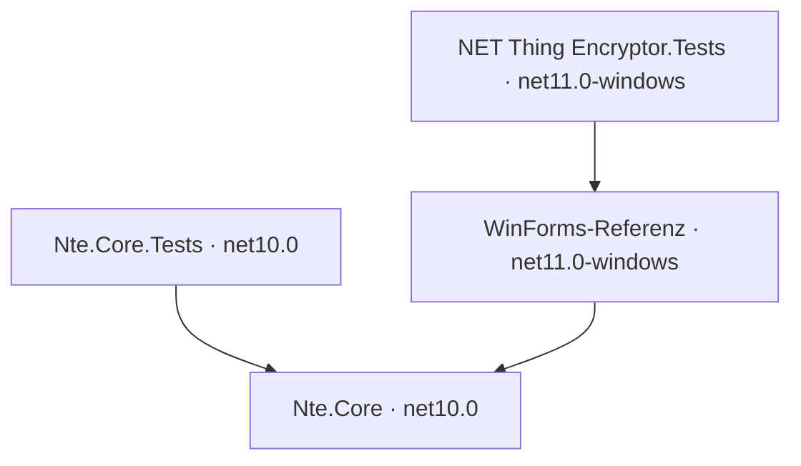

# M1 – plattformneutraler Kern

Stand: 29. August 2026

## Ziel und Ergebnis

M1 trennt die fachliche Kernlogik von WinForms, ohne die bestehende Windows-Anwendung abzulösen. Kryptografie, Tresormodell, Persistenz, Dateioperationen, Suche, Altdatenmigration und natürliche Sortierung werden als `Nte.Core` für `net10.0` gebaut. Die WinForms-Anwendung referenziert diesen Kern und bleibt die ausführbare Referenz für Version 3.7.0.

M1 enthält noch keine Avalonia-Oberfläche und keinen Android-Einstiegspunkt. Plattformgerechte Speicherung und streambasierter Dateiimport/-export folgen in M2.

## Projektstruktur

| Projekt | Verantwortung | Plattformbindung |
|---|---|---|
| `Nte.Core` | Modell, Sitzung, Kryptografie, Persistenz, Transaktionen, Suche, Sortierung und Altbestandsmigration | keine Windows-Desktop-Referenz |
| `Nte.Core.Tests` | Golden-Fixture und Tests der gemeinsamen Kernlogik | `net10.0`, ohne WinForms |
| `NET Thing Encryptor` | bestehende Oberfläche, Dialoge, Viewer, Medien und Windows-Start | Windows/WinForms |
| `NET Thing Encryptor.Tests` | verbleibende Tests für WinForms-Steuerelemente und Anwendungsversion | Windows/WinForms |

Der Namespace `NET_Thing_Encryptor` bleibt vorerst erhalten. Dadurch kann die Windows-Referenz die extrahierten Typen ohne einen gleichzeitigen UI-Umbau verwenden. Eine rein kosmetische Namespace-Umbenennung würde die Migration derzeit nur vergrößern.

## Technische Entscheidungen

### Kompatible Fassade und Sitzungsobjekt

Die öffentliche statische `ThingData`-API bleibt für die WinForms-Anwendung und die M0-Kompatibilitätstests erhalten. Ihre Schlüssel, der entschlüsselte Root-Zustand und der Saving-Zähler liegen jetzt in `VaultSession`. `ThingData.CurrentSession` macht diese Grenze sichtbar und erlaubt später die Umstellung von ViewModels auf injizierte Sitzungen.

`VaultSession.Lock()` überschreibt Schlüssel und historischen IV und entfernt die entschlüsselte Root-Linkliste. M1 erstellt bewusst noch keinen frei instanziierbaren vollständigen Tresordienst: Zwei parallele Sitzungen würden mit den weiterhin statischen Dateioperationen eine falsche Sicherheit vortäuschen. Die statische Fassade wird erst zusammen mit den Speicherabstraktionen weiter aufgelöst.

### Keine UI-Aufrufe im Kern

`ThingData.LoadMainData()` zeigt keine `MessageBox` mehr. Stattdessen sendet der Kern `VaultNotificationEventArgs` mit Titel, Nachricht und Schweregrad. `WinFormsVaultNotificationAdapter` übersetzt diese Meldungen für die alte Oberfläche zurück in Windows-Dialoge. Eine künftige Avalonia- oder Android-Oberfläche kann denselben Vertrag anders darstellen.

Die `PictureBox.ClearImage()`-Erweiterung liegt nun ausschließlich im WinForms-Projekt. Der Core-Assembly-Test verbietet Referenzen auf `System.Windows.Forms`, `System.Drawing.Common` und `Microsoft.Windows*`.

### Aufteilung von `ThingData`

Die bisherige monolithische Datei ist entlang ihrer Verantwortungen geteilt:

- `ThingData.cs`: Sitzung, Kryptografie, Passwortprüfung und Laden der Root-Datei
- `ThingData.Persistence.cs`: IDs, Objektpfade, Laden, Speichern und atomare Schreibvorgänge
- `ThingData.Operations.cs`: transaktionale Mutationen, Rollback, Verschieben, Umbenennen und Löschen

Die Aufteilung verändert weder NTE2 noch die öffentliche Kompatibilitätsoberfläche.

### Plattformneutrale Sortierung und Pfade

Die natürliche Sortierung verwendet keinen Aufruf von `shlwapi.dll` mehr. Der verwaltete `NaturalStringComparer` vergleicht Text kulturabhängig ohne Beachtung der Großschreibung und Zahlenfolgen nach ihrem numerischen Stellenwert. Beispielsweise gilt `file2 < file02 < file10`.

`AppPaths.PathEquals` verwendet auf Windows einen case-insensitiven, auf Linux/macOS/Android einen case-sensitiven Vergleich. Der Standard für Import- und Exportdialoge bleibt unter Windows das Laufwerks-Root wie bisher; auf anderen Plattformen wird das Benutzerverzeichnis verwendet. Bereits gespeicherte absolute Windows-Pfade bleiben unverändert lesbar und werden erst in M2 auf ein portables Speichermodell abgebildet.

## Testaufteilung und Verifikation

| Prüfung | M1-Ergebnis |
|---|---|
| `Nte.Core.Tests` unter .NET 10/Windows | 78 bestanden, 0 fehlgeschlagen, 0 übersprungen |
| verbleibende WinForms-Tests unter .NET 11/Windows | 15 bestanden, 0 fehlgeschlagen, 0 übersprungen |
| vollständige Solution | 93 bestanden |
| Cross-Target-Build `Nte.Core` für `linux-x64` | erfolgreich, 0 Warnungen, 0 Fehler |
| M0-Golden-Fixture | unverändert und mit SHA-256 geprüft |
| Windows-Desktop-Referenzen in `Nte.Core` | durch Assembly-Test ausgeschlossen |
| Self-contained Windows-Publish | erfolgreich; `Nte.Core.dll` enthalten |
| Statische Installer-Prüfung | erfolgreich; Version und SHA-256 bestätigt |

Der lokale, weiterhin unsignierte M1-Installer ist 94.570.196 Bytes groß und hat den SHA-256-Wert `90994fc93a16bdc9c705c85c6c390ec44da177863bf246fb017d87453cefc50b`.

Ein neuer Ubuntu-CI-Job führt `Nte.Core.Tests` mit .NET 10 aus. Lokal war keine WSL-Distribution vorhanden; daher ist der reale Linux-Lauf erst nach Ausführung dieses CI-Jobs bestätigt. Der erfolgreiche `linux-x64`-Build prüft bereits die Kompilierbarkeit, ersetzt aber keinen Laufzeittest.

Ein Test für das Rollback beim Löschen einer durch `FileShare.None` gesperrten Datei läuft nur unter Windows. POSIX erlaubt das Entfernen einer geöffneten Datei. M2 ergänzt einen injizierbaren Storage-Fehler, damit derselbe Rollback-Pfad unabhängig vom Betriebssystem getestet werden kann.

## Datenkompatibilität

M1 verändert das Tresorformat nicht:

- NTE2/AES-GCM, Nonce, Tag und Associated Data bleiben unverändert.
- PBKDF2-HMAC-SHA-256 bleibt bei 10.000 Iterationen und 48 Byte Schlüsselmaterial.
- Historische AES-CBC-Dateien bleiben lesbar.
- Root-JSON, Hex-IDs und Dateinamen bleiben kompatibel.
- Das synthetische Fixture befindet sich jetzt im plattformneutralen Testprojekt unter `Nte.Core.Tests/Fixtures/baseline-v3.7`.

Die WinForms-Referenz und der neue Kern dürfen während der Migration weiterhin nicht gleichzeitig denselben Tresor verändern.

## CI und Toolchain

Die gemischte Solution benötigt:

- .NET 10 SDK `10.0.400` für `Nte.Core` und `Nte.Core.Tests`
- .NET 11 SDK Preview 7 `11.0.100-preview.7.26381.103` für die WinForms-Referenz

Windows-CI und Release-CI installieren beide SDKs. Der Linux-Job installiert nur .NET 10 und sieht dadurch sofort, falls sich eine Windows-Abhängigkeit wieder in den Core einschleicht.

## Bekannte Grenzen und Übergabe an M2

- `ThingData` ist weiterhin eine statische Kompatibilitätsfassade. ViewModels sollen später eine Instanzschnittstelle statt globaler Zustände erhalten.
- `AppPaths` und die Persistenz arbeiten weiterhin mit normalen Dateisystempfaden. Android-`content://`-URIs und das Storage Access Framework sind noch nicht abgebildet.
- Root-Datei und Objektablage können weiter an verschiedenen absoluten Orten liegen.
- Verschlüsselung und JSON-Verarbeitung puffern komplette Objekte im Speicher.
- Atomarer Move, Freigabesemantik und case-sensitives Verhalten hängen weiterhin vom konkreten Dateisystem ab.
- Die Windows-Anwendung verwendet weiterhin WinForms, Windows-Dateidialoge, LibVLCSharp.WinForms und die Windows-Pakete von VLC/ImageMagick.

M2 beginnt deshalb mit `IVaultStorage`, streambasierten Import-/Exportverträgen und einer expliziten Zuordnung zwischen Root und Objektablage. Danach kann ein kleiner Avalonia-Machbarkeitstest denselben Core verwenden, ohne die Persistenz erneut an eine UI zu koppeln.

## M1-Abschlusskriterien

- [x] Gemeinsames `Nte.Core`-Projekt auf `net10.0` angelegt.
- [x] Kryptografie, Modell, Persistenz, Suche und Dateioperationen aus WinForms extrahiert.
- [x] Direkte UI- und Windows-Desktop-Abhängigkeiten aus dem Core entfernt.
- [x] Sensiblen globalen Zustand in `VaultSession` gekapselt.
- [x] Natürliche Sortierung vollständig verwaltet implementiert.
- [x] Plattformabhängige Pfad-Großschreibung berücksichtigt.
- [x] Core-Tests ohne WinForms getrennt und unter Windows ausgeführt.
- [x] WinForms-Referenz kompiliert und alle Windows-Tests sind grün.
- [x] `linux-x64`-Cross-Target-Build erfolgreich.
- [x] Linux-CI-Testjob eingerichtet.
- [ ] Reale Ausführung des neuen Ubuntu-CI-Jobs bestätigt.

Der letzte Punkt benötigt einen veröffentlichten Branch oder einen Pull Request. Er blockiert den lokalen M1-Commit nicht, muss aber vor Beginn der plattformabhängigen M2-Speicherimplementierung grün bestätigt werden.
