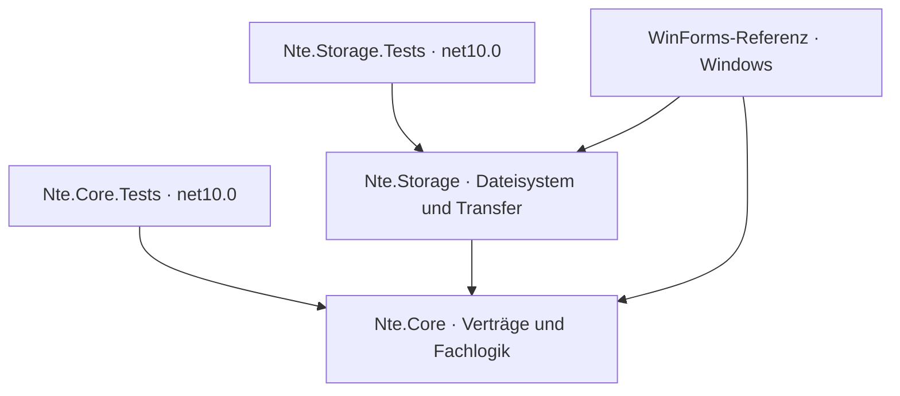

# M2 – plattformgerechte Speicherung und Tresortransfer

Stand: 29. August 2026

## Ziel und Ergebnis

M2 trennt die verschlüsselte Tresorpersistenz vom lokalen Dateisystem. `Nte.Core` kennt nur noch den Vertrag `IVaultStorage`; atomare Schreibvorgänge, verschlüsselte Snapshots, Wiederherstellung, lokale Pfadauflösung und die Migration alter Installationsordner liegen in `Nte.Storage`.

Zusätzlich stellt M2 streambasierte Schnittstellen für einzelne Dokumente und einen vollständigen Tresortransfer bereit. Damit kann eine spätere Android-Oberfläche Streams des Storage Access Framework beziehungsweise eines `content://`-Providers übergeben, ohne dem Core einen Android- oder Windows-Pfad vorzutäuschen.

M2 führt noch keine Avalonia- oder Android-Oberfläche ein. Die `.ntevault`-Funktionen sind als getesteter Dienst vorhanden; die sichtbaren Befehle für vollständigen Tresorimport und -export werden zusammen mit der neuen Oberfläche in M3 ergänzt.

## Projektstruktur



| Projekt | M2-Verantwortung | Plattformbindung |
|---|---|---|
| `Nte.Core` | Tresormodell, Kryptografie, Operationen, `IVaultStorage`, Streamimport und -export | `net10.0`, ohne Windows-Desktop-Referenz |
| `Nte.Storage` | Dateisystemadapter, atomare Dateien, Snapshots, Altpfadzuordnung und `.ntevault`-Transfer | plattformneutrale .NET-Dateisystem-APIs |
| `Nte.Storage.Tests` | Archiv-, Pfad-, Stream-, Konflikt- und Fehlerinjektionstests | `net10.0`, für Windows und Linux-CI |
| `NET Thing Encryptor` | Konfiguration des Windows-Dateisystemadapters und bestehende Dateidialoge | Windows/WinForms |

`Nte.Core` referenziert `Nte.Storage` nicht. Ein Assembly-Test sichert diese Abhängigkeitsrichtung zusätzlich zu den bereits verbotenen Windows-Desktop-Referenzen ab.

## Storage-Vertrag

`IVaultStorage` adressiert die Root-Datei mit ID `0` und Objektdateien mit ihrer 64-Bit-ID. Der Vertrag umfasst:

- Initialisierung und implementierungsspezifische Altdatenmigration,
- Prüfung und Auflistung verschlüsselter Objekte,
- Öffnen eines Lesestreams,
- atomisches Schreiben aus einem Stream,
- Löschen,
- vollständige oder auf IDs begrenzte Snapshots mit Wiederherstellung,
- Sicherung einer beschädigten Root-Datei,
- Auflösung eines gespeicherten Speicherorts und explizites Setzen eines vom Nutzer gewählten Orts.

`ThingData.ConfigureStorage(...)` setzt den Adapter vor dem Laden eines Tresors. Die statische `ThingData`-Fassade bleibt als Migrationsbrücke bestehen; ihre Persistenzmethoden führen selbst keine Dateioperationen mehr aus.

### Dateisystemadapter

`FileSystemVaultStorage` implementiert den Vertrag für Windows, Linux und macOS mit normalen Verzeichnissen. Er schreibt zunächst eine temporäre Datei im Zielverzeichnis, leert den Betriebssystempuffer und ersetzt anschließend atomar die Zieldatei. Mutationen erstellen verschlüsselte Snapshots in einem temporären Anwendungsverzeichnis. Bei einem Fehler werden Root und alle betroffenen Objekte wiederhergestellt.

Ein in der Root gespeicherter Objektpfad wird nur übernommen, wenn er der lokale Standardpfad ist oder dort tatsächlich 16-stellig benannte `.nte`-Objekte liegen. Ein nicht vorhandener Windows-Pfad einer anderen Maschine wird auf den lokalen Standard abgebildet. Eine ausdrückliche Auswahl in den Windows-Einstellungen bleibt dagegen bindend.

Diese Heuristik vermeidet, dass ein übertragener Tresor unbemerkt ein leeres `C:\...`- oder Laufwerksverzeichnis der Quellmaschine verwendet. Android erhält später einen eigenen Adapter für App-Sandbox und persistierte Dokumentanbieter-Berechtigungen.

## Streambasierter Dokumenttransfer

Die neuen Methoden

```csharp
ThingData.ImportFileAsync(Stream source, string fileName, ulong parentId, ...)
ThingData.ExportFileAsync(ulong id, Stream destination, ...)
```

verlangen weder einen Dateisystempfad noch einen seekbaren Stream. Die WinForms-Referenz verwendet sie bereits hinter ihren Windows-Dateidialogen. Derselbe Vertrag kann in Android direkt mit einem vom Content Resolver geöffneten Stream verwendet werden.

Das bestehende NTE2-Format serialisiert den Inhalt eines `ThingFile` weiterhin vollständig als JSON und verschlüsselt ihn anschließend. Import und Entschlüsselung puffern deshalb weiterhin das gesamte einzelne Objekt im Speicher. M2 beseitigt die Pfadkopplung, noch nicht diese Formatgrenze.

## Vollständiges `.ntevault`-Archiv

`VaultArchiveService` exportiert und importiert einen vollständigen Tresor über caller-eigene Streams. Das Archiv ist ein ZIP-Container mit unkomprimierten, bereits verschlüsselten NTE-Payloads:

```text
manifest.json
root/0.nte
objects/<16-stellige-ID>.nte
```

Das Manifest enthält Formatname, Version, Erstellungszeit, Länge und SHA-256 für jeden Payload. Beim Import werden Pfade, doppelte Einträge, nicht gelistete Inhalte, Größen und alle Hashes geprüft, bevor die erste Zieldatei geschrieben wird. ZIP-Pfadtraversal und zusätzliche Payloads werden abgewiesen.

`ExportCurrentAsync(...)` sperrt während des Exports konkurrierende Core-Mutationen und ist der vorgesehene Einstieg für eine UI. `ExportAsync(storage, ...)` dient einem bereits ruhenden, explizit angegebenen Adapter, beispielsweise bei Offline-Tests oder Werkzeugen.

Objektdateien werden byteidentisch übertragen. In der Root-Datei bleibt `ContentEncrypted` unverändert; nur `SaveLocation` wird auf den lokalen Zieladapter umgesetzt. Dadurch bleiben Passwort, Salt, verschlüsselte Linkliste, Einstellungen, IDs und Objektinhalte erhalten, während ein fremder absoluter Pfad nicht weiterverwendet wird.

Der Container fügt keine zweite Verschlüsselungsschicht hinzu. Objektinhalte und Root-Linkliste besitzen denselben Schutz wie im normalen Tresor; die ohnehin unverschlüsselten Root-Einstellungen und das Manifest sind im ZIP sichtbar. Ein Archiv muss daher wie der ursprüngliche Tresor behandelt werden.

### Konflikt- und Fehlerverhalten

- Import ist nur in einen leeren Zieladapter erlaubt.
- Existiert eine Root- oder Objektdatei, bricht der Import vor dem Schreiben mit `VaultStorageConflictException` ab.
- Die Root wird zuletzt geschrieben und dient damit als Commit-Markierung.
- Schlägt ein Schreibvorgang fehl, stellt der Storage-Snapshot den vorherigen Zustand wieder her.
- Nicht seekbare Eingabestreams werden in eine temporäre Datei im privaten Temp-Verzeichnis übertragen, weil ZIP-Lesen einen seekbaren Eingang benötigt. Die darin enthaltenen NTE-Payloads bleiben verschlüsselt; die temporäre Datei wird nach Erfolg oder Fehler entfernt.

## Kompatibilität

M2 ändert das Tresorformat nicht:

- NTE2/AES-GCM, Nonce, Tag und Associated Data bleiben unverändert.
- PBKDF2-Parameter und historisches AES-CBC-Lesen bleiben unverändert.
- Root-JSON und 16-stellige Hex-Dateinamen bleiben lesbar.
- Das M0-Golden-Fixture wird weiterhin ohne Neuschreiben geladen.
- Bestehende getrennte Root- und Objektverzeichnisse funktionieren im Dateisystemadapter weiter.
- Die Windows-Anwendung bleibt die ausführbare Referenz und nutzt denselben Adapter wie ihre bisherigen Pfade.

## Automatisierte Abnahme

M2 ergänzt Tests für:

- Import und Export mit nicht seekbaren Streams,
- vollständigen Archiv-Roundtrip und anschließendes Entsperren,
- vollständigen Transfer des unveränderten M0-/3.7-Golden-Tresors,
- byteidentische verschlüsselte Objektdateien,
- Umsetzung eines fremden `SaveLocation` auf den lokalen Zielpfad,
- Ablehnung eines manipulierten Payloads per SHA-256,
- Konfliktabbruch ohne Überschreiben,
- Wiederherstellung eines leeren Ziels nach injiziertem Archiv-Schreibfehler,
- plattformunabhängigen Mutations-Rollback nach injiziertem Löschfehler,
- unveränderte M0-Golden-Kompatibilität,
- fehlende Rückreferenz von `Nte.Core` auf `Nte.Storage`.

Windows führt weiterhin den vollständigen Solution-Test aus. Der Ubuntu-CI-Job führt sowohl `Nte.Core.Tests` als auch `Nte.Storage.Tests` unter .NET 10 aus.

| Prüfung | lokales M2-Ergebnis |
|---|---|
| `Nte.Core.Tests` unter Windows | 80 bestanden |
| `Nte.Storage.Tests` unter Windows | 6 bestanden |
| WinForms-Tests unter Windows | 15 bestanden |
| vollständige Solution | 101 bestanden, 0 fehlgeschlagen, 0 übersprungen |
| Cross-Target-Build `Nte.Core.Tests` für `linux-x64` | erfolgreich, 0 Warnungen, 0 Fehler |
| Cross-Target-Build `Nte.Storage.Tests` für `linux-x64` | erfolgreich, 0 Warnungen, 0 Fehler |
| Self-contained Windows-Publish | erfolgreich; `Nte.Core.dll` und `Nte.Storage.dll` enthalten |
| statische Installer-Prüfung | Version und SHA-256 erfolgreich geprüft |

Der lokale, weiterhin unsignierte M2-Installer ist 94.583.993 Bytes groß und hat den SHA-256-Wert `b02d0026ddb016562a4982ba3e49b1279458c930a711c8b0b35313e1643c2705`.

## Bekannte Grenzen und Übergabe an M3

- `ThingData` bleibt eine statische Kompatibilitätsfassade; Avalonia-ViewModels sollen instanzbasierte Dienste erhalten.
- Android-Sandbox und Storage Access Framework benötigen einen eigenen `IVaultStorage`-Adapter sowie persistierte URI-Berechtigungen.
- Vollständiger Tresortransfer besitzt in WinForms noch keinen sichtbaren Menüpunkt.
- Einzelne `ThingFile`-Inhalte werden weiterhin vollständig im Speicher verarbeitet.
- Die Root-Einstellungen sind wie im Bestandsformat nicht vollständig verschlüsselt; eine Änderung wäre eine eigene Formatmigration.
- Der WinForms-Notfalleditor und die Speicherort-Verschiebeoberfläche bleiben dateisystemspezifisch und werden nicht in die gemeinsame UI übernommen.
- Prozessabbruch genau während eines atomaren Moves und voller Datenträger benötigen später zusätzliche Plattform- und Gerätetests.

M3 kann damit auf `Nte.Core` und `Nte.Storage` aufsetzen, ohne Persistenzcode in Avalonia-Views zu duplizieren. Der erste vertikale Schnitt sollte Entsperren, Ordnernavigation sowie Dokumentimport/-export auf Windows und Android gegen dieselben Services ausführen.

## M2-Abschlusskriterien

- [x] `IVaultStorage` als plattformneutraler Persistenzvertrag eingeführt.
- [x] Root- und Objekt-I/O aus `ThingData` in den Dateisystemadapter verlagert.
- [x] Atomare Schreibvorgänge und Mutations-Snapshots über den Adapter umgesetzt.
- [x] Fremde oder nicht verfügbare absolute Pfade lokal neu zugeordnet.
- [x] Nicht seekbare Stream-Schnittstellen für Dokumentimport und -export umgesetzt.
- [x] Vollständiges `.ntevault`-Archiv mit versioniertem Manifest und SHA-256 umgesetzt.
- [x] Zielkonflikte überschreiben keine Datei.
- [x] Import- und Mutationsfehler werden per Storage-Snapshot zurückgerollt.
- [x] WinForms-Referenz auf den Dateisystemadapter und die Stream-Schnittstellen umgestellt.
- [x] Windows- und Linux-CI-Konfiguration um Storage-Tests erweitert.
- [ ] Reale Ausführung des Ubuntu-CI-Jobs bestätigt.
- [ ] Android-Dateisystem-/SAF-Adapter auf einem Emulator oder Gerät bestätigt.

Die letzten beiden Punkte benötigen CI beziehungsweise M3/M4-Plattformcode und blockieren den lokalen M2-Quellstand nicht.
