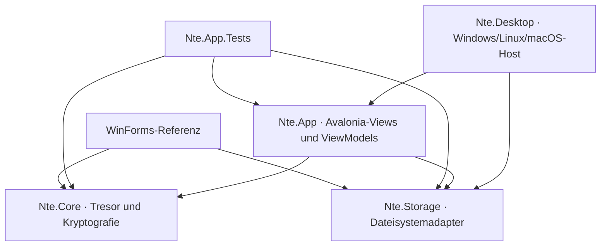

# M3 – Gemeinsamer Avalonia-Client und Desktop-Host

Stand: 29. August 2026
Framework: Avalonia 12.1.1 auf .NET 10

## Ziel und Ergebnis

M3 führt den ersten nutzbaren Avalonia-Vertikalschnitt ein, ohne die WinForms-Referenz zu entfernen. Der neue Client lädt denselben Tresor, entsperrt ihn mit demselben Passwort und verwendet unverändert das NTE2-/3.7-Datenformat aus M0 bis M2.

Der Schnitt umfasst:

- Laden, Erstpasswort und Entsperren eines Tresors,
- Sperren und Löschen des entschlüsselten Sitzungsschlüssels,
- Navigation durch Root und Unterordner,
- atomare Erzeugung neuer Ordner,
- Mehrfachimport von Dokumenten über caller-eigene Lesestreams,
- Export eines ausgewählten Dokuments über einen caller-eigenen Schreibstream,
- sichtbaren Export eines vollständigen `.ntevault`-Archivs,
- Import eines `.ntevault`-Archivs in einen leeren, gesperrten Tresor,
- Status- und Fehlermeldungen ohne Abhängigkeit von WinForms-Dialogen.

Windows ist der primär geprüfte Desktop-Host. Linux und macOS verwenden dasselbe `Nte.Desktop`-Projekt und Avalonia wählt den jeweiligen nativen Backend automatisch. M3 enthält noch kein Android-Paket und keinen Android-`IVaultStorage`; diese beiden Bestandteile sind der Kern von M4.

## Projektstruktur

| Projekt | M3-Verantwortung | Plattformbindung |
|---|---|---|
| `Nte.App` | gemeinsame Views, ViewModels, Befehle, Anwendungsschnittstellen und Avalonia-Dateiauswahl | Avalonia, aber kein Desktop-Backend und keine Windows-UI-Assembly |
| `Nte.Desktop` | Composition Root und `UsePlatformDetect()` für Windows, Linux und macOS | `Avalonia.Desktop` |
| `Nte.App.Tests` | Zustands-, Befehls-, Grenz- und End-to-End-Tests des Vertikalschnitts | `net10.0`, ohne gestartete native Oberfläche |
| `Nte.Core` | zusätzliche transaktionale Ordnererzeugung | keine UI-Bindung |

Das Desktop-Backend liegt ausschließlich in `Nte.Desktop`. Ein Assembly-Test verbietet `Avalonia.Desktop`, `System.Windows.Forms`, `System.Drawing.Common` und `Microsoft.Windows*` in `Nte.App`. Ein späterer Android-Host kann dadurch dieselben Views und ViewModels laden, ohne ein Desktop-Paket mitzuziehen.

## Anwendungs- und Dateiauswahlverträge

`IVaultApplicationService` ist die instanzbasierte Grenze vor der weiterhin statischen `ThingData`-Kompatibilitätsfassade. Der konkrete `ThingDataVaultService` konfiguriert genau einen `IVaultStorage`, übersetzt Core-Links in unveränderliche `VaultItem`-Modelle und stellt nur die für den M3-Schnitt benötigten Operationen bereit.

Die ViewModels erhalten keine Pfade und keine Avalonia-`IStorageFile`-Objekte. `IFilePickerService` liefert stattdessen kleine lesbare oder schreibbare Dateiverträge, deren Streams der Aufrufer besitzt und schließt. `AvaloniaFilePickerService` bildet diese Verträge auf `TopLevel.StorageProvider` ab. Damit funktionieren native Windows-, Linux- und macOS-Dialoge; derselbe Avalonia-Dienst kann in M4 Android-`content://`-Dokumente öffnen, ohne sie in lokale Dateipfade umzudeuten.

`ThingData.CreateFolderAsync(...)` ergänzt den Core um die einzige neue Fachoperation. Root- beziehungsweise Elternlink, neue verschlüsselte Ordnerdatei und Root-/Elterndatei werden unter dem bestehenden Mutations-Lock geschrieben. Ein Storage-Snapshot und der Root-Speicherabzug stellen bei einem Fehler den vorherigen Zustand wieder her. Namenskonflikte werden wie bei Verschieben und Umbenennen ohne Beachtung der Groß-/Kleinschreibung abgewiesen.

## Oberfläche und Zustände

`AppShellViewModel` hält genau eine der drei Seiten:

1. **Laden:** Der Storage wird initialisiert und die Root-Metadaten werden geladen.
2. **Entsperren:** Das Passwort wird geprüft. Beim ersten Start wird der neue Root anschließend sofort gespeichert, sodass das erste Passwort verbindlich ist.
3. **Tresor:** Die Root- und Ordnerinhalte werden angezeigt. Auswahlabhängige Befehle verhindern Dateien im Root und den Export eines Ordners als einzelnes Dokument.

Die Navigation hält nur IDs und sichtbare Namen als Breadcrumb. Ordnerinhalte werden bei jedem Wechsel erneut über den Anwendungsdienst geladen. Dateien werden natürlich sortiert; Ordner stehen vor Dokumenten.

Beim Mehrfachimport werden gleichnamige Dokumente als `Name (2)`, `Name (3)` und so weiter angelegt. Der Core bleibt die letzte Instanz für Konfliktprüfung und Persistenz. Import und Export laufen asynchron; die bekannte M2-Formatgrenze bleibt bestehen, sodass der Inhalt eines einzelnen `ThingFile` weiterhin vollständig im Speicher verarbeitet wird.

## Vollständiger Tresortransfer

Der bislang nur als M2-Dienst vorhandene Archivtransfer ist in M3 sichtbar:

- **Export:** ist im entsperrten Tresor verfügbar und schreibt ein `.ntevault`-Archiv über den Systemdialog.
- **Import:** ist auf der Sperrseite nur aktiv, wenn der Zieladapter noch keine Root-Datei besitzt. Nach erfolgreichem Import werden die Root-Metadaten neu geladen; der Benutzer entsperrt anschließend mit dem Passwort des importierten Tresors.
- **Konflikte:** Ein vorhandener Tresor wird niemals ersetzt. Für einen bewussten Austausch muss ein separates leeres Datenziel verwendet werden.

Das Archiv besitzt keine zusätzliche Verschlüsselungsschicht. Es muss weiterhin wie der ursprüngliche Tresor behandelt werden.

## Plattform- und Startkonfiguration

`Nte.Desktop` verwendet standardmäßig `AppPaths.DataDirectory` und übernimmt damit denselben Datenordner wie WinForms. Die optionale Umgebungsvariable `NTE_DATA_DIRECTORY` erlaubt isolierte Entwicklungs- oder manuelle Migrationstests; in diesem Modus wird keine automatische Suche nach Altverzeichnissen ausgeführt.

Der Schalter `--startup-probe` verwendet ohne explizites Datenverzeichnis einen zufälligen Ordner unter dem Betriebssystem-Temp-Verzeichnis, baut die vollständige Avalonia-Oberfläche auf und schließt sie nach erfolgreicher Initialisierung über den UI-Dispatcher. Der temporäre Ordner wird danach entfernt. CI verwendet diesen Einstieg unter Linux mit Xvfb.

## Automatisierte Abnahme

| Prüfung | lokales M3-Ergebnis |
|---|---|
| `Nte.Core.Tests` unter Windows | 82 bestanden |
| `Nte.Storage.Tests` unter Windows | 6 bestanden |
| `Nte.App.Tests` unter Windows | 12 bestanden |
| WinForms-Tests unter Windows | 15 bestanden |
| vollständige Solution | 115 bestanden, 0 fehlgeschlagen, 0 übersprungen |
| Avalonia-Desktop-Build | erfolgreich, 0 Warnungen, 0 Fehler |
| Windows `--startup-probe` | erfolgreich, Exitcode 0 |
| Runtime-Publish `linux-x64` | erfolgreich |
| Runtime-Publish `osx-arm64` | erfolgreich |
| bestehender WinForms-Installer | Publish, Inno-Setup-Build und statische Prüfung erfolgreich |

Die neuen Tests prüfen unter anderem Entsperrzustände, Meldungsweitergabe, Navigation, Root-Importregel, eindeutige Namen beim Mehrfachimport, Dokumentexport, Ordnererzeugung, Archivbefehle, verbotene Desktop-Referenzen und einen vollständigen Dokument-/Archiv-Roundtrip durch den echten Core und Dateisystemadapter.

Die Workflow-Konfiguration ergänzt einen Linux-Starttest unter Xvfb und einen macOS-ARM64-Publish. Deren tatsächliche Ausführung auf GitHub Actions ist erst nach dem nächsten CI-Lauf bestätigt.

Der lokal erzeugte, weiterhin unsignierte WinForms-Installer ist 94.596.608 Bytes groß und hat den SHA-256-Wert `ebf3b01cd9483425c87cfe9afb6c0630163db138f0dc9f61d35d5ff0f9916754`. Der Avalonia-Client wird in M3 noch nicht über diesen Installer verteilt.

## Bekannte Grenzen und Übergabe an M4

- Es existiert noch kein `net10.0-android`-Hostprojekt und daher noch kein APK/AAB.
- Der Tresor selbst liegt auf Android noch nicht in App-Sandbox oder einem persistierten Dokumentanbieter.
- Android-Lifecycle, Hintergrundsperre, Bildschirmaufnahmen, Back-Navigation und Prozesswiederherstellung sind noch nicht implementiert.
- Dateiimport und -export sind streamgeeignet, das NTE2-Objektformat puffert aber weiterhin ein vollständiges Dokument.
- Vorschau, Suche, Umbenennen, Verschieben, Löschen, Einstellungen und Medienwiedergabe bleiben in diesem ersten Avalonia-Schnitt außerhalb des Umfangs.
- Für Linux und macOS wurden lokal Cross-Publishes erstellt, aber in dieser Windows-Umgebung keine native manuelle Interaktion durchgeführt.

M4 kann nun einen kleinen Avalonia-Android-Host ergänzen, `Nte.App` unverändert referenzieren und sich auf Android-Sandbox, Storage Access Framework, persistierte URI-Berechtigungen und Lifecycle-Sicherheit konzentrieren.

## M3-Abschlusskriterien

- [x] Avalonia 12.1.1 und gemeinsames `Nte.App`-Projekt eingeführt.
- [x] Desktop-Host für Windows, Linux und macOS angelegt.
- [x] `ThingData` hinter einem instanzbasierten Anwendungsdienst verborgen.
- [x] Entsperren, Sperren, Ordnernavigation und Ordnererzeugung umgesetzt.
- [x] Dokumentimport und -export ausschließlich über Streams und Systemdialoge umgesetzt.
- [x] Vollständiger Tresorimport und -export in der Oberfläche verfügbar.
- [x] Gemeinsame ViewModels ohne Desktop- oder Windows-UI-Referenz abgesichert.
- [x] Windows-Starttest und Linux-/macOS-Publishes lokal erfolgreich.
- [x] Bestehende WinForms-Referenz und alle M0-/M1-/M2-Tests bleiben grün.
- [ ] Linux-Starttest und macOS-Publish im realen CI-Lauf bestätigt.
- [ ] Android-Host und Android-Storage auf Emulator oder Gerät bestätigt; folgt in M4.
