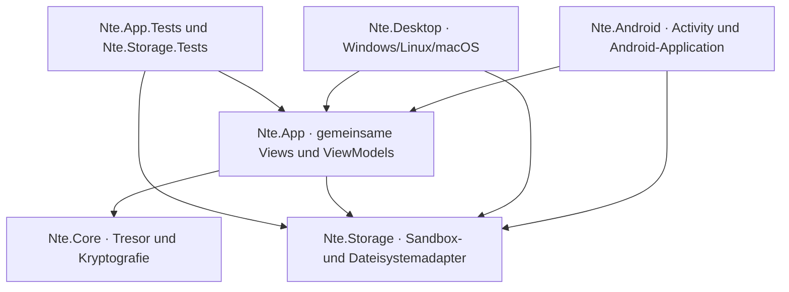

# M4 – Android-Host, Sandbox und Sitzungsschutz

Stand: 30. August 2026
Framework: Avalonia 12.1.1 auf .NET 10 und Android API 31 bis 36

## Ziel und Ergebnis

M4 ergänzt den gemeinsamen Avalonia-Client aus M3 um einen installierbaren Android-Host. Windows bleibt zusammen mit Android die primäre Zielplattform; Linux und macOS verwenden weiterhin denselben Desktop-Host und werden durch die Android-Erweiterung nicht mit Android-Abhängigkeiten belastet.

Der Android-Schnitt kann:

- einen verschlüsselten Tresor ausschließlich im privaten App-Speicher anlegen und laden,
- denselben NTE2-/3.7-Datenbestand wie Windows entsperren,
- Ordner anzeigen, navigieren und anlegen,
- Dokumente über den Android-Dokumentanbieter importieren und exportieren,
- vollständige `.ntevault`-Archive über den Dokumentanbieter übertragen,
- beim App-Wechsel, nach fünf Minuten Inaktivität und über System-Zurück sperren,
- laufende Dateioperationen beim Sperren abbrechen und entschlüsselte Ansichten leeren,
- Bildschirmaufnahmen des App-Inhalts mit Android `FLAG_SECURE` unterbinden.

M4 ersetzt die WinForms-Anwendung noch nicht und veröffentlicht noch kein produktiv signiertes Play-Store-Paket. Der bestehende Windows-Installer bleibt unverändert die veröffentlichte Referenz.

## Projektstruktur



| Projekt oder Datei | M4-Verantwortung |
|---|---|
| `Nte.Android` | Android-Composition-Root, Activity-Lifecycle, private App-Pfade, Manifest und APK |
| `Nte.App` | gemeinsamer Single-View-/Desktop-Aufbau, mobile Layouts, Back-Navigation und Sitzungsschutz |
| `Nte.Storage/AppSandboxVaultStorage.cs` | erzwingt einen festen Tresor unter dem plattformeigenen privaten App-Verzeichnis |
| `build/desktop.slnf` | hält Android aus dem bestehenden Windows-Installer-Build heraus |
| `.github/workflows/ci.yml` | eigener Linux-Job für Android-Workload und Release-APK |

Ein Architekturtest verbietet nun auch `Avalonia.Android` in `Nte.App`. Damit bleibt nur der kleine Host plattformgebunden; Views, ViewModels, Anwendungsdienst und Speicherverträge bleiben gemeinsam nutzbar.

## Android-Host

`Nte.Android` zielt auf `net10.0-android`, unterstützt Android ab API 31 und baut gegen API 36. Der Host verwendet den Avalonia-12-Einstieg mit einer nicht generischen `AvaloniaMainActivity` sowie einer `AvaloniaAndroidApplication<Nte.App.App>`. `IActivityApplicationLifetime.MainViewFactory` erzeugt die gemeinsame `AppShellView`; der Desktop-Host setzt dieselbe View in sein `MainWindow` ein.

Das Debug-APK bettet verwaltete Assemblies vollständig ein. Dadurch lässt es sich unabhängig von Fast Deployment mit `adb install` installieren und starten. Der Release-Build trimmt und AOT-kompiliert die konfigurierten Architekturen `arm64-v8a` und `x86_64`.

Der Android-Host setzt folgende Manifestgrenzen:

- `android:allowBackup="false"` und `android:fullBackupContent="false"`,
- `android:usesCleartextTraffic="false"`,
- keine allgemeine Lese- oder Schreibberechtigung für gemeinsamen Speicher,
- keine Netzwerkberechtigung; die transitive `INTERNET`-Deklaration wird beim Manifest-Merge entfernt,
- Launcher-Activity ist ab Android 12 ausdrücklich exportiert.

## Privater Tresor und Dokumentanbieter

`AppSandboxVaultStorage` erhält `Context.FilesDir` vom Android-Host und legt darunter ausschließlich das Verzeichnis `vault` an. Gespeicherte Objektpfade einer anderen Installation oder eines Windows-Rechners werden bewusst auf diesen lokalen Sandboxpfad abgebildet. Der Adapter lehnt jeden Versuch ab, den aktiven Objektordner aus der Sandbox heraus zu verschieben.

Die verschlüsselten Tresorobjekte liegen damit unter:

```text
<privates App-Verzeichnis>/files/vault
```

Import und Export verwenden weiterhin Avalonia `IStorageFile.OpenReadAsync()` beziehungsweise `OpenWriteAsync()`. Android-`content://`-URIs werden nie als Dateisystempfade interpretiert. Die App benötigt deshalb keine breite Speicherberechtigung.

M4 speichert absichtlich keine dauerhaften URI-Berechtigungen: Ein externes Dokument oder Archiv wird nur während der vom Benutzer gestarteten Übertragung geöffnet, und der aktive Tresor bleibt in der App-Sandbox. Wenn später ein externes Verzeichnis als dauerhaft aktiver Tresor angeboten wird, braucht dieses eigenständige Feature persistierte Tree-URI-Berechtigungen, eine Wiederanlaufprüfung und eine Behandlung widerrufener Freigaben.

## Lebenszyklus und Sitzungsschutz

`AppLifecycleCoordinator` verbindet Android-Lifecycle, Avalonia-Eingaben und native Dokumentdialoge. Die Regeln sind:

| Ereignis | Verhalten |
|---|---|
| Activity wechselt ohne nativen Dialog in `OnStop` | Sitzung wird sofort gesperrt |
| Dokumentdialog versetzt die Activity vorübergehend in den Hintergrund | Sperre wird bis zur Rückkehr oder bis zum Ende des Dialogs zurückgestellt |
| Dokumentdialog bleibt im Hintergrund | spätestens nach zwei Minuten wird gesperrt |
| keine Zeiger- oder Tastatureingabe | nach fünf Minuten wird gesperrt |
| System-Zurück in einem Unterordner | navigiert eine Ebene nach oben |
| System-Zurück im Tresor-Root | sperrt den Tresor und kehrt zur Entsperrseite zurück |
| System-Zurück während einer Operation | wird konsumiert; der aktuelle Zustand bleibt stabil |
| Prozess wird beendet und neu erzeugt | startet ohne Sitzungsschlüssel auf der Entsperrseite |

Eine Sicherheitssperre storniert das aktive ViewModel-Operationstoken, ruft `ThingData.Lock()` über den Anwendungsdienst auf, leert die sichtbare Objektliste und ersetzt die Tresoransicht. Datei- und Transferoperationen reichen das Token bis zu Pickern, Streams und Diensten weiter.

Native Dateiauswahl ist eine Besonderheit: Android kann dafür die Activity stoppen, obwohl der Benutzer die App nicht bewusst verlassen hat. Ein gezählter `BeginExternalInteraction()`-Scope verhindert die sofortige Sperre, ohne unbegrenzt einen Hintergrundschlüssel zu behalten.

## Mobile Oberfläche

Die gemeinsame Fensteransicht wurde in eine `AppShellView` und eine reine Desktop-`MainWindow`-Hülle getrennt. Entsperr- und Tresoransicht verwenden Scrollcontainer, kleinere Ränder und umbrechende Aktionsgruppen. Der Inhaltsbereich eines Tresoreintrags kann auf schmalen Displays unter den Namen umbrechen. Desktop und Android verwenden dabei dieselben DataTemplates und Befehle.

Der Android-System-Back-Request wird am Avalonia-`TopLevel` behandelt. Zeiger- und Tastaturereignisse aktualisieren denselben Inaktivitätszeitpunkt; eine spätere plattformspezifische Touch-Geste muss daher keinen separaten Timer pflegen.

## Build, CI und Distribution

Ein lokaler Release-Build entsteht mit:

```powershell
$env:AVALONIA_TELEMETRY_OPTOUT = '1'
dotnet build ".\Nte.Android\Nte.Android.csproj" -c Release
```

GitHub Actions installiert Java 17, .NET SDK 10.0.400 und den Android-Workload in einem separaten Ubuntu-Job. Anschließend wird das Release-APK als `NET-Thing-Encryptor-Android` hochgeladen. Der bestehende Installer-Job verwendet `build/desktop.slnf`; er braucht dadurch keinen Android-Workload und baut weiterhin alle Desktop-, Core- und Testprojekte.

Das lokal erzeugte `com.joelbu.netthingencryptor-Signed.apk` ist 40.800.541 Bytes groß und hat den SHA-256-Wert `5ad8ca8af4a96e0157294a2b860e4346268b5dd78679061b08109812d985e4e1`. Die Signaturprüfung bestätigt Android-Signaturschema v3. Dieses APK verwendet jedoch nur die lokale Android-Entwicklersignatur und ist kein Produktionsartefakt. Für eine Veröffentlichung müssen ein geschützter Release-Keystore, reproduzierbare Version-Codes und vorzugsweise ein Android App Bundle ergänzt werden.

## Automatisierte und manuelle Abnahme

| Prüfung | lokales M4-Ergebnis |
|---|---|
| `Nte.Core.Tests` | 82 bestanden |
| `Nte.Storage.Tests` | 9 bestanden |
| `Nte.App.Tests` | 20 bestanden |
| Android-Debug-Build | erfolgreich, 0 Warnungen, 0 Fehler |
| Android-Release-Build | erfolgreich, 0 Warnungen, 0 Fehler |
| Release-Signaturprüfung | APK verifiziert, v3-Schema aktiv |
| Android-Manifestprüfung | API 31/36; kein Internet und keine allgemeine Speicherberechtigung |
| Android API-35-Emulator | Debug und Release installiert; Kaltstart jeweils erfolgreich |
| Release-Kaltstart auf Emulator | Prozess nach 1,183 Sekunden aktiv; kein fataler Logcat-Eintrag |
| private Datenablage | `/data/user/10/com.joelbu.netthingencryptor/files/vault`, Modus `drwx------` |
| Bildschirmaufnahme | App-Inhalt durch `FLAG_SECURE` schwarz; Systemleisten bleiben sichtbar |
| Windows-Avalonia-Startprobe | erfolgreich, Exitcode 0 |
| Desktop-Solution-Filter und Installer-Skriptsyntax | erfolgreich geprüft |

Die neuen Tests prüfen Sandbox-Remapping, das Ablehnen externer Pfade, Verzeichnis-Escape, sofortige und verzögerte Hintergrundsperre, Picker-Rückkehr, Inaktivität, System-Zurück und die Android-Abhängigkeitsgrenze.

Der lokale Rechner enthält derzeit nur .NET SDK 10.0.400. Die `net11.0-windows`-WinForms-Tests und der vollständige Installerlauf konnten deshalb in M4 nicht erneut ausgeführt werden; diese Prüfungen bleiben Aufgabe des vorhandenen Windows-CI-Jobs mit .NET 11 Preview 7. Der neue Desktop-Filter wurde lokal aufgelöst, und der gemeinsame Avalonia-Client wurde über die Windows-Startprobe regressionsgeprüft.

## Bekannte Grenzen und Übergabe

- Die Prüfung erfolgte auf einem Android-API-35-x86_64-Emulator, noch nicht auf einem realen Telefon oder Tablet.
- Die Unlock-Seite und ihre Controls wurden im nativen UI-Baum bestätigt; eine vollständige Touch-Eingabe ließ sich im verwendeten Automotive-Emulator nicht zuverlässig automatisieren.
- Die CI-Konfiguration ist lokal validiert, aber der neue Android-Job ist erst nach einem realen GitHub-Actions-Lauf bestätigt.
- Das NTE2-Objektformat puffert weiterhin den vollständigen Inhalt eines Dokuments. Ein belastbares mobiles Speicherbudget und große Dateien bleiben offen.
- Vorschau, Suche, Umbenennen, Verschieben, Löschen, Einstellungen sowie Bild-, Audio- und Videowiedergabe gehören noch nicht zum Avalonia-Vertikalschnitt.
- Play-Store-/Managed-Play-Verteilung, Produktionssignatur, Updatekanal und Backup-/Wiederherstellungsprozess sind offen.
- Linux- und macOS-Pakete bleiben sekundär; die M3-Cross-Publishes werden durch M4 nicht verschlechtert, wurden in diesem Meilenstein aber nicht erneut nativ bedient.

## M4-Abschlusskriterien

- [x] Installierbaren Avalonia-Android-Host für API 31 bis 36 angelegt.
- [x] Gemeinsame `Nte.App`-Oberfläche über Android-Activity-Lifetime gestartet.
- [x] Aktiven Tresor auf das private App-Verzeichnis begrenzt.
- [x] Import und Export über Dokumentanbieter-Streams ohne breite Speicherberechtigung angebunden.
- [x] Hintergrund-, Inaktivitäts- und System-Zurück-Sperre umgesetzt und getestet.
- [x] Native Dokumentdialoge mit begrenzter Lifecycle-Ausnahme abgesichert.
- [x] Bildschirmaufnahmen des App-Inhalts mit `FLAG_SECURE` blockiert.
- [x] Debug- und Release-APK auf einem API-35-Emulator kalt gestartet.
- [x] Android-Release-Build und APK-Upload in CI ergänzt.
- [x] Bestehenden Windows-Installer-Build über einen Desktop-Solution-Filter isoliert.
- [ ] Android-CI-Job in GitHub Actions erfolgreich bestätigt.
- [ ] Reales Android-Gerät einschließlich Touch, SAF-Ablehnung und App-Wechsel geprüft.
- [ ] Produktive Android-Signatur und Distributionsformat eingerichtet.
- [ ] Mobile Speichergrenze sowie Medienfunktionen umgesetzt und geprüft.

## Technische Referenzen

- [Avalonia: Supported Platforms](https://docs.avaloniaui.net/docs/supported-platforms)
- [Avalonia: Android platform guide](https://docs.avaloniaui.net/docs/platform-specific-guides/android)
- [Avalonia 12 breaking changes](https://docs.avaloniaui.net/docs/avalonia12-breaking-changes)
- [Avalonia: Storage Provider](https://docs.avaloniaui.net/docs/services/storage/storage-provider)
- [Android: Access documents and other files](https://developer.android.com/training/data-storage/shared/documents-files)
- [Android: `FLAG_SECURE`](https://developer.android.com/reference/android/view/WindowManager.LayoutParams#FLAG_SECURE)
- [Android: Auto Backup](https://developer.android.com/identity/data/autobackup)
