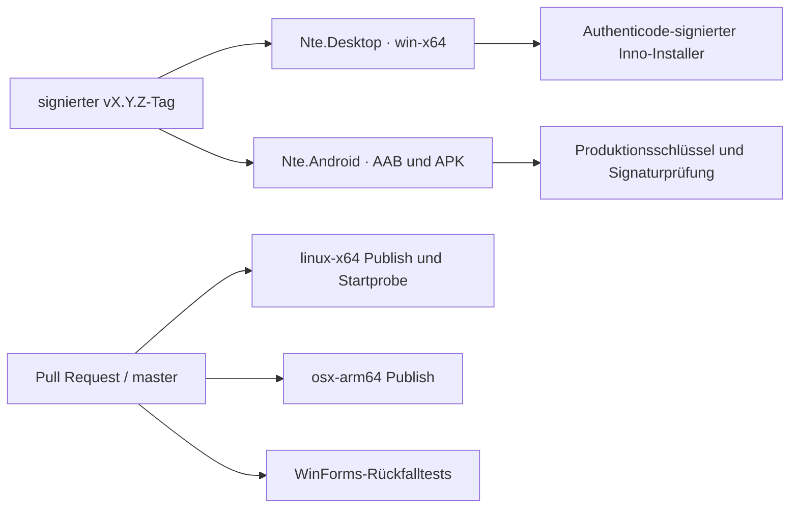

# M6 – kontrollierter Produkt-Cutover

## Ziel

M6 macht den gemeinsamen Avalonia-Client zur regulären Produktlinie. Windows und Android sind die priorisierten Auslieferungsziele; Linux und macOS bleiben in der Build-Matrix, erhalten aber noch keine distributions- beziehungsweise storespezifischen Endnutzerpakete. Der bestehende WinForms-Quellcode wird nicht gelöscht. Er bleibt für einen begrenzten Zeitraum als eingefrorener Rückfallpfad verfügbar.

## Auslieferung nach M6



| Ziel | M6-Status | Veröffentlichung |
|---|---|---|
| Windows x64 | kanonisch | selbstenthaltender, signierter Avalonia-Installer |
| Android 12+ | kanonisch | signiertes AAB und signierte APK |
| Linux x64 | technische Vorschau | CI-Artefakt und Startprobe, kein natives Paket |
| macOS ARM64 | technische Vorschau | CI-Artefakt, noch kein signiertes/notarisiertes App-Bundle |
| WinForms | eingefrorener Rückfallpfad | kein reguläres Release-Artefakt |

## Technischer Cutover

- `Nte.Desktop/Nte.Desktop.csproj` ist die kanonische Quelle für Windows-Produkt-, Assembly- und Dateiversion sowie für das Anwendungssymbol.
- `build/build-installer.ps1` publiziert `Nte.Desktop` self-contained für `win-x64`. Es prüft die gemeinsamen Assemblies und Avalonia statt VLC/ImageMagick.
- Der Installer behält App-ID, Zielverzeichnis und Datenpfad der bisherigen Ausgabe. Ein Upgrade ersetzt damit die Anwendung in-place.
- `Nte.Desktop` hält denselben benannten Anwendungs-Mutex wie der WinForms-Client, damit Inno Setup eine laufende Instanz vor Upgrade oder Deinstallation schließen kann.
- `build/test-installer.ps1` prüft nach jeder stillen Testinstallation die gemeinsamen Assemblies und führt `--startup-probe` aus, bevor es deinstalliert.
- `build/desktop.slnf` enthält nur die produktive Avalonia-Linie. `build/legacy-winforms.slnf` trennt die Rückfalltests von Release-Build und Installer.
- Android-Release-Builds erzeugen `aab;apk`. Der Tag-Workflow verlangt einen Produktions-Keystore, prüft AAB und APK und erzeugt SHA-256-Prüfsummen.
- Die Release-Pipeline akzeptiert einen Tag nur, wenn Tag, Windows-Version und sichtbare Android-Version übereinstimmen.

## Datenkompatibilität

Der Cutover führt kein neues Tresorformat ein. Beide Windows-Clients verwenden weiterhin:

```text
%LOCALAPPDATA%\NET Thing Encryptor\Data
```

Das NTE2-/3.7-Format, Schlüsselableitung, Dateinamen und Root-Datei bleiben unverändert. Ein portabler `Data`-Ordner neben der EXE wird weiterhin atomisch in das Benutzerprofil kopiert. Die Inno-Upgrade-Regeln löschen ausschließlich eindeutig alte VLC- und ImageMagick-Abhängigkeiten. `{app}\Data` wird weder beim Upgrade noch bei der Deinstallation entfernt.

Vor einem produktiven Cutover werden Kopien eines realen Tresors mindestens in dieser Reihenfolge geprüft:

1. Letzte veröffentlichte WinForms-Version öffnet und speichert die Kopie.
2. Neuer Avalonia-Installer aktualisiert die Installation und öffnet dieselbe Kopie.
3. Import, Export, Umbenennen, Verschieben und Löschen werden ausgeführt.
4. Die resultierende Kopie wird nochmals mit dem WinForms-Rückfallbuild gelesen, ohne sie zum normalen Weiterarbeiten zu verwenden.

## Release-Gates

| Gate | Automatisch | Vor Produktion zusätzlich manuell |
|---|---:|---|
| Core-, Storage- und App-Tests | ja | – |
| Windows self-contained Publish | ja | Windows 10 und 11 unter Standardbenutzer |
| Englische/deutsche Installation und Deinstallation | ja | Upgrade einer bestehenden realen Installation |
| Start der installierten Avalonia-App | ja | vollständiger entsperrter Bedienpfad |
| Daten bleiben bei Deinstallation erhalten | ja | Sicherung und Vergleich eines produktionsnahen Tresors |
| Android AAB und APK gebaut/signiert | ja | interner Store-Kanal und reales Android-12+-Gerät |
| Android Sitzungssperre und Dokumentanbieter | teilweise durch Komponententests | Hintergrund-/Wiederaufnahme- und Anbieterprüfung auf realem Gerät |
| Linux Publish und Start | ja | distributionsspezifische Paketierung offen |
| macOS Publish | ja | Signierung, Notarisierung und Startprobe auf Hardware offen |
| WinForms-Rückfallbuild | ja | nur bei tatsächlicher Rückfallentscheidung |

Ein produktiver Tag wird erst erstellt, wenn alle automatischen Gates auf `master` grün sind und die für Windows und Android genannten manuellen Punkte für den Release-Kandidaten protokolliert wurden.

## Rückfallplan

Ein Rückfall verwendet niemals einen alten Installer oder ein zurückgesetztes Android-`versionCode`:

1. Betroffenes Release zurückziehen beziehungsweise deutlich als fehlerhaft markieren und weitere Rollouts stoppen.
2. Benutzerdaten nicht verändern; für Diagnose ausschließlich Kopien verwenden.
3. Fehler nach Plattform und Datenformat-Auswirkung klassifizieren.
4. Wenn ein schneller Avalonia-Fix möglich ist, eine höhere Patch-Version veröffentlichen.
5. Nur wenn Avalonia nicht rechtzeitig reparierbar ist, den letzten grünen Stand aus `build/legacy-winforms.slnf` auf einem Rückfallzweig bauen. Gemeinsamen Core und Storage nicht auf ein inkompatibles Format zurücksetzen.
6. Rückfallbuild mit einer höheren Patch-Version, derselben Inno-App-ID und gültiger Signatur ausliefern, damit das Downgrade-Verbot nicht umgangen wird.
7. Für Android immer eine korrigierte AAB/APK mit höherem `ApplicationVersion` veröffentlichen; WinForms ist dort kein Rückfallpfad.
8. Nach Stabilisierung Ursache, betroffene Versionen und Wiederaufnahme des Avalonia-Rollouts dokumentieren.

## Ende des WinForms-Rückfallfensters

Der WinForms-Code kann in einem späteren, eigenen Änderungssatz entfernt werden, wenn alle folgenden Bedingungen erfüllt sind:

- mindestens zwei aufeinanderfolgende produktive Avalonia-Windows-Releases wurden ohne datenverlustkritischen Fehler ausgerollt;
- mindestens vier Wochen seit dem ersten allgemeinen Avalonia-Rollout sind vergangen;
- Upgrade, Deinstallation mit Datenerhalt und ein echter Tresor-Kompatibilitätstest sind protokolliert;
- Windows-10- und Windows-11-Abnahme ist abgeschlossen;
- es existiert ein getaggter, reproduzierbarer letzter WinForms-Rückfallstand;
- offene Funktionen aus M5 wurden entweder umgesetzt oder als bewusste Produktentscheidung akzeptiert.

Bis dahin gilt für WinForms ein Feature-Freeze: nur sicherheitskritische und für einen reproduzierbaren Rückfall notwendige Änderungen sind zulässig.

## Bewusst offene Produktlücken

Der Cutover ändert die in M5 festgehaltenen Grenzen nicht:

- keine Audio- oder Videowiedergabe im Avalonia-Client;
- Einzelbildansicht, aber keine Bildserie oder automatische Wiedergabe;
- Export einzelner Dateien, keine sichtbare Mehrfachauswahl für den Export;
- große Dateien werden derzeit vollständig gepuffert;
- Mehrfachoperationen sind pro Objekt atomisch, nicht als Gesamttransaktion;
- Linux und macOS besitzen noch keine produktionsfertige Paketierung.

Diese Punkte werden im Release-Hinweis genannt. Sie dürfen nicht durch die Bezeichnung „Feature-Parität“ verdeckt werden.

## M6-Abnahme

Die lokale Abnahme am 30. August 2026 ergab:

| Prüfung | Ergebnis |
|---|---|
| `Nte.Core.Tests` | 84 bestanden |
| `Nte.Storage.Tests` | 9 bestanden |
| `Nte.App.Tests` | 34 bestanden |
| Gesamt | 127 bestanden, 0 fehlgeschlagen |
| Windows `win-x64` self-contained Publish | erfolgreich |
| Windows Publish-Startprobe | Exitcode 0 |
| Exakter StartProcess-Aufruf des Installer-Smoke-Tests | Exitcode 0 |
| benannter Anwendungs-Mutex | zweite Instanz beendet; Neustart nach Freigabe erfolgreich |
| Inno Setup 6.7.3 | erfolgreich |
| statische Installerprüfung | Version und SHA-256 erfolgreich |
| Installer | 35.556.909 Bytes, SHA-256 `6e4c73be9f7cb9993076689e8b4f899f8acc2a2c9465fb4e258eeba5c01f7d1a` |
| Android Release | AAB und APK erzeugt; `Version=3.7.0`, `versionCode=30700` |
| Android Produktionssignierungsweg | sauberer Build mit temporärem Keystore; AAB- und APK-Signatur erfolgreich geprüft |
| Linux-x64-Cross-Publish | erfolgreich |
| macOS-ARM64-Cross-Publish | erfolgreich |
| Solution-Filter und PowerShell-Skripte | JSON- beziehungsweise Parserprüfung erfolgreich |
| Workflow-Dateien | Diff und Struktur lokal geprüft; tatsächliche GitHub-Ausführung ausstehend |
| nicht zu M6 gehörende Benutzeränderungen | nicht verändert und nicht für M6 vorgesehen |

Produktionssignaturen, Installation in einer sauberen VM, Upgrade einer veröffentlichten WinForms-Installation, realer Android-Hardwaretest sowie die Ausführung der neuen GitHub-Workflows bleiben externe Release-Gates.
