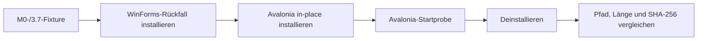

# M7 – WinForms-Stilllegungsvorbereitung

## Ziel und Entscheidung

M7 bereitet die spätere Entfernung des WinForms-Clients vor und macht den Rückfall bis dahin reproduzierbar. Der Quellcode wird in diesem Meilenstein bewusst noch nicht gelöscht: Die in M6 festgelegten Produktions-, Zeit- und Hardware-Gates können einen Tag nach dem Cutover nicht erfüllt sein.

Die M7-Entscheidung lautet daher **behalten unter Feature-Freeze**. WinForms bleibt aus der regulären Produktlinie und aus allen Release-Artefakten ausgeschlossen, wird aber als überprüfbarer Notfallpfad gebaut. Seine Entfernung erfolgt erst nach einem erneuten dokumentierten Gate-Entscheid.

## Gate-Stand am 31. August 2026

| Löschkriterium aus M6 | Stand | Entscheidung |
|---|---|---|
| zwei produktive Avalonia-Windows-Releases ohne datenverlustkritischen Fehler | nicht erfüllt | blockiert Löschung |
| vier Wochen seit allgemeinem Avalonia-Rollout | nicht erfüllt | blockiert Löschung |
| Upgrade, Deinstallation und echtes Tresorfixture protokolliert | automatischer Nachweis ergänzt; produktionsnaher manueller Test offen | blockiert Löschung |
| Windows 10 und Windows 11 manuell abgenommen | offen | blockiert Löschung |
| getaggter, reproduzierbarer letzter WinForms-Stand | Buildweg vorhanden; Freigabe-Tag offen | blockiert Löschung |
| offene M5-Funktionen umgesetzt oder bewusst akzeptiert | nicht abschließend entschieden | blockiert Löschung |

Diese Bewertung ist kein Aufschub durch technische Unsicherheit. Sie verhindert, dass der einzige Windows-Rückfallpfad vor realen Rollouterfahrungen entfernt wird.

## Reproduzierbares Rückfallpaket

Das bestehende Installer-Skript besitzt zwei ausdrücklich getrennte Produktlinien:

```powershell
# reguläres Produkt
.\build\build-installer.ps1 -ProductLine Avalonia -Clean

# eingefrorener Notfallpfad
.\build\build-installer.ps1 -ProductLine WinFormsRollback -Clean
```

`Avalonia` bleibt Standard. `WinFormsRollback` verwendet `build/legacy-winforms.slnf`, das alte Windows-Projekt, dessen eigenes Symbol und einen getrennten Artefaktstamm. Das Rückfallsetup heißt:

```text
artifacts\legacy-winforms\installer\
NET-Thing-Encryptor-WinForms-Rollback-Setup-<Version>.exe
```

Der Dateiname verhindert eine Verwechslung mit dem regulären Setup. Die Release-Pipeline nimmt ausschließlich Dateien aus `artifacts/installer` auf. Ein Rückfallpaket kann deshalb nicht durch den normalen Tag-Workflow veröffentlicht werden.

Der Rückfallbuild behält absichtlich dieselbe Inno-App-ID, denselben Installationspfad und dasselbe Datenformat. Im tatsächlichen Notfall benötigt er gemäß M6 eine höhere Patch-Version und eine gültige Signatur; ein Downgrade auf eine alte Versionsnummer bleibt verboten.

## Automatischer Upgrade-Beweis

Der neue CI-Job `windows-upgrade-proof` baut beide Installer auf einem sauberen Windows-Runner und führt `build/test-winforms-upgrade.ps1` aus.



Der Test verwendet die stabile App-ID und ein gemeinsames Installationsverzeichnis. Vor dem ersten Setup kopiert er das M0-Fixture in `%LOCALAPPDATA%\NET Thing Encryptor\Data`. Nach dem Upgrade prüft er:

- die erwarteten Avalonia-, App-, Core- und Storage-Assemblies;
- die Entfernung des alten `libvlc`-Verzeichnisses sowie der LibVLCSharp-/ImageMagick-Assemblies;
- Produktversion und Startfähigkeit der installierten Avalonia-App;
- unveränderte Pfade, Dateilängen und SHA-256-Werte des gesamten Fixtures.

Nach der Deinstallation wird das Fixture erneut verglichen. Der Test läuft nur in einem leeren CI-Konto oder nach der expliziten lokalen Freigabe `-AllowLocalMachineChanges`; vorhandene Installation oder Benutzerdaten führen zum Abbruch.

## Feature-Freeze

Bis zur Entfernung gelten für `NET Thing Encryptor` und `NET Thing Encryptor.Tests` diese Regeln:

- keine neuen Produktfunktionen;
- keine Übernahme neuer UI-Arbeit aus Avalonia;
- nur Sicherheitskorrekturen, Buildreparaturen und Änderungen, die einen tatsächlich beschlossenen Rückfall ermöglichen;
- kein reguläres Release-Artefakt und keine Android-Abhängigkeit;
- jede unvermeidbare Änderung muss den Upgrade-Beweis und die gemeinsamen Kompatibilitätstests bestehen.

## Spätere Entfernung

Wenn alle M6-Kriterien erfüllt sind, erfolgt die Löschung in einem eigenen, überprüfbaren Commit:

1. letzten grünen WinForms-Rückfallstand unveränderlich taggen;
2. CI-Nachweise und manuelle Releaseprotokolle im Gate-Entscheid verlinken;
3. `NET Thing Encryptor`, `NET Thing Encryptor.Tests`, `build/legacy-winforms.slnf`, den `WinFormsRollback`-Buildzweig und `windows-upgrade-proof` entfernen;
4. Haupt-Solution, Dokumentation und Restorepfade bereinigen;
5. alle gemeinsamen Tests, Windows-/Android-Pakete und sekundären Cross-Publishes erneut prüfen;
6. niemals Benutzerdaten, Golden-Fixtures oder Formatkompatibilitätscode als Teil dieser Quellbereinigung löschen.

## M7-Abnahme

Die lokale Abnahme am 31. August 2026 ergab:

| Prüfung | Ergebnis |
|---|---|
| PowerShell-Parser für Build- und Upgrade-Skript | bestanden |
| regulärer Avalonia-Installerbuild 3.7.0 einschließlich Prüfsumme | bestanden |
| statische Installerprüfung und isolierte Desktop-Startprobe | bestanden |
| lokaler Abbruchschutz des Upgrade-Tests | bestanden, keine Installation verändert |
| gemeinsame Core-, Storage- und App-Tests | 127 bestanden, 0 fehlgeschlagen |
| beide Solution-Filter und sechs CI-PowerShell-Blöcke | bestanden |
| drei nicht zu M7 gehörende Testpaketänderungen | unverändert und nicht Teil des M7-Commits |
| WinForms-Build und vollständiges in-place Upgrade | nur in CI ausführbar; externe Ausführung offen |

Der WinForms-Build und der echte in-place Installationslauf benötigen .NET 11 Preview 7 und ein leeres Windows-Testkonto. Beides ist im neuen CI-Job konfiguriert, lokal aber nicht vorhanden beziehungsweise nicht sicher isolierbar. Die tatsächliche GitHub-Ausführung bleibt daher ein externer M7-Nachweis und wird nicht als lokal bestanden ausgegeben.
